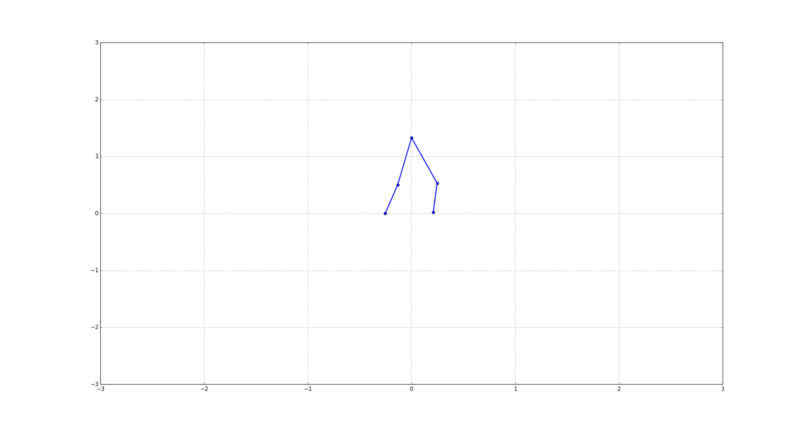
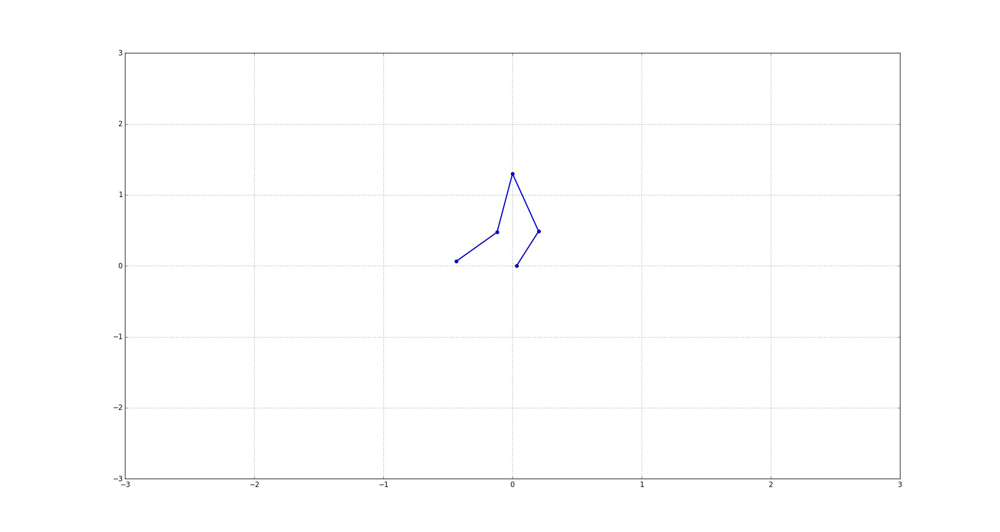
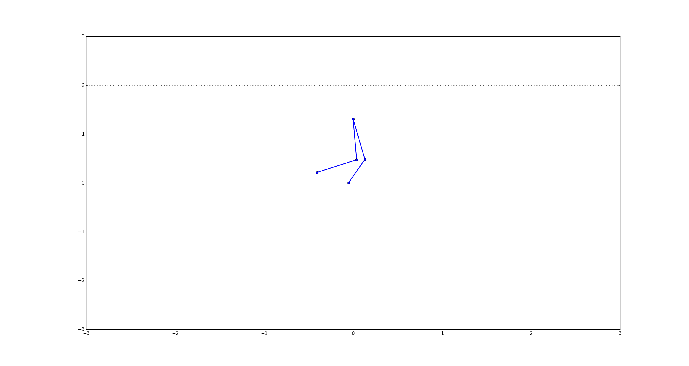
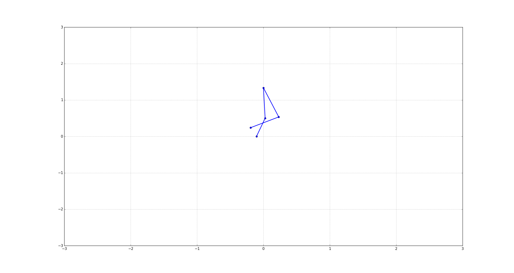

## Walking model for Lower Limb Exoskeleton 






#### Edit config.json accroding to subject
``` json
{
  "TEST_FILE": "bin/test01.csv",
  "NEW_FORMAT": true,
  "SUBJECT": {
    "MASS": 64,
    "HEIGHT": 1.7,
    "JOINT_sequence": {
                      "0":"Left.Knee.Angle",
                      "1":"Left.Hip.Angle",
                      "2":"Right.Hip.Angle",
                      "3":"Right.Knee.Angle",
                      "4":"Right.Ankle.Angle",
                      "5":"Left.Ankle.Angle"
                      },
    "CALIBRATION":{
                "Left.Knee.Angle":{
                                    "index":8,
                                    "multiplier":1,
                                    "offset":180
                                    },
                "Left.Hip.Angle":{
                                    "index":5,
                                    "multiplier":1,
                                    "offset":100
                                    },
                "Right.Hip.Angle":{
                                    "index":20,
                                    "multiplier":1,
                                    "offset":-90
                                    },
                "Right.Knee.Angle":{
                                    "index":15,
                                    "multiplier":1,
                                    "offset":0
                                    },
                "Right.Ankle.Angle":{
                                    "index":14,
                                    "multiplier":1,
                                    "offset":-105
                                    },
                "Left.Ankle.Angle":{
                                    "index":9,
                                    "multiplier":1,
                                    "offset":-80
                                    } 
            }
  }
}
```

#### run this file for testing
```shell
python stick_model.py
```

#### run this file for kinematic model
```shell
python kin_testing.py
```

#### Directory structure

```shell
.
├── bin
│   ├── test.csv
│   └── traj.csv
├── FES
│   ├── fes.py
│   ├── __init__.py
│   └── Muscle.py
├── kin_testing.py
├── README.md
├── stick_model.py
├── utils
│   └── get_meta_data.py
└── walking_model
    ├── dynamics.py
    ├── __init__.py
    ├── Plotter.py
    ├── common.py
    └── Subject.py

```

#### walking_model description
- *Subject.py* is a model class with all attributes of the lower exoskeleton
- *Plotter.py* is a visualizer for the lower exoskeleton model
- *dynamics.py* is a helper module to calculate the dynamic model
- *common.py* has all the required helper functions